<p align="center">
  
</p>

<p align="center">
  
  
  
  
  
</p>

<p align="center">
  <b>Hand Bronze your character once.</b> It keeps an immutable history of every state you were ever in,<br>
  sims each one for free on self-hosted SimulationCraft, and joins the projection against your real combat logs.
</p>


## ⚔️ What is Bronze?

A player answering *"what should I do with my character this week?"* opens six tabs today: Raidbots for the sim, Wowhead for talents, Warcraft Logs for parses, Raider.IO for the score, the Armory for gear, and an addon for the `/simc` export. None of them remember the player. The synthesis lives in the player's head.

**That synthesis is the product.** Bronze is a persistent character workbench: a durable, versioned record of a character plus a planning layer built on top of it. The working name comes from the Bronze Dragonflight, who govern time, because character history over time is the whole point.

<p align="center">
  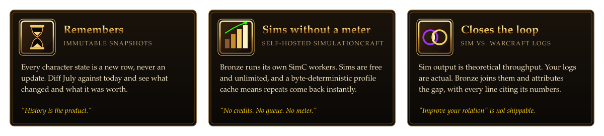
</p>

| | **Bronze** | Raidbots | Wowhead | Warcraft Logs |
|---|:---:|:---:|:---:|:---:|
| Remembers your character over time | ✅ | ❌ | ❌ | ❌ |
| Free, unlimited sims | ✅ | credit-gated | no sims | no sims |
| Ranks your vault choices from your real gear | ✅ | manual Top Gear | ❌ | ❌ |
| Joins sim projection to actual log performance | ✅ | ❌ | ❌ | ❌ |


## 🎁 Loot table

Every feature, presented the only way a WoW player should ever have to read a feature list. Rarity is roughly how hard it is to get anywhere else:
$${\color{orange}\textsf{Legendary}}$$ nobody has it · $${\color{mediumorchid}\textsf{Epic}}$$ exists behind a meter · $${\color{gold}\textsf{Artifact}}$$ requires owning both halves · $${\color{dodgerblue}\textsf{Rare}}$$ exists without your context · $${\color{lime}\textsf{Uncommon}}$$ precedent exists, nobody generalised it

<table>
  <tr>
    <td width="33%" valign="top">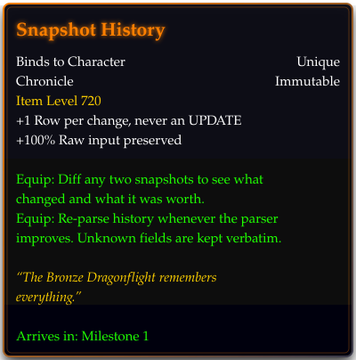</td>
    <td width="33%" valign="top">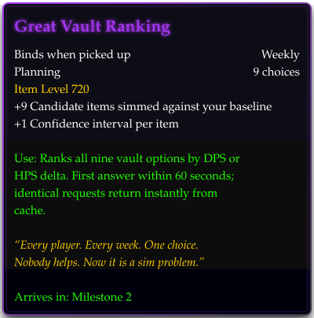</td>
    <td width="33%" valign="top">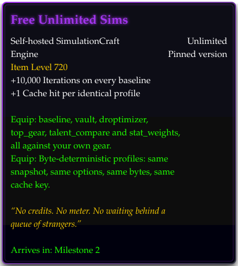</td>
  </tr>
  <tr>
    <td width="33%" valign="top">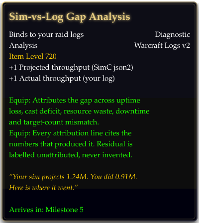</td>
    <td width="33%" valign="top">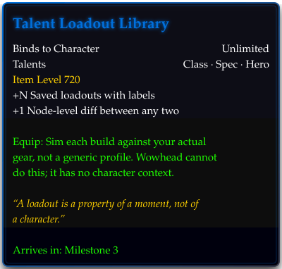</td>
    <td width="33%" valign="top">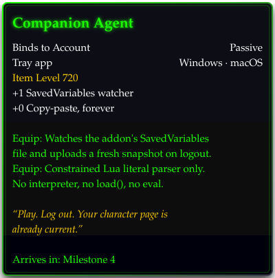</td>
  </tr>
</table>

<details>
<summary><b>🧭 Further down the loot table</b> (ranked by demand × feasibility × defensibility)</summary>
<br>

| # | Feature | Why nobody has it |
|---|---|---|
| 3.5 | **Multi-character weekly planning** | Engaged players run 3–10 characters. Nobody ranks what each one needs this week. |
| 3.6 | **Persistent acquisition planning** | Droptimizer is a one-shot answer. Nobody keeps a standing plan with expected value and effort attached. |
| 3.8 | **Group-relative valuation** | Augmentation Evoker's value depends on the roster. Nobody models "what does this spec add to *this* group." |
| 3.9 | **Patch delta impact** | Guides say what changed. Nobody re-sims *your* stored snapshot against the new build. |
| 3.10 | **Alt-aware gear routing** | Which character should get the crafted piece, given each one's marginal gain. |

</details>


## 🔮 What it looks like

### The snapshot diff

Snapshots are immutable rows. Diffing two of them is a structural diff plus a sim delta, so a change is never just "the trinket changed" but "the trinket changed and it was worth this much."

```diff
  snapshot 2026-08-26  →  snapshot 2026-09-09        equipped ilvl 706 → 710
- trinket1 = 219315   bonus_id=6652/10356   ilvl 701
+ trinket1 = 219321   bonus_id=6652/10371   ilvl 714        sim delta  +2.1%
- main_hand           crafted_stats=32/36   quality 4/5
+ main_hand           crafted_stats=32/36   quality 5/5     sim delta  +0.9%
  talents             unchanged             (loadout "raid ST")
  ─────────────────────────────────────────────────────────────────────────
+ baseline DPS        1.198M → 1.240M                        +3.4%  ± 0.4%
```

### The gap report

The differentiating feature. SimC's `json2` output gives per-ability expected damage and APL execution counts. Warcraft Logs gives actual casts, damage, and uptimes. Bronze joins them and attributes the gap across a ruleset of causes. Every line must cite the numbers that produced it.

<p align="center">
  
</p>


## 🗺️ Battle plan

Four ingest paths feed one append-only table. Everything downstream reads from it; nothing writes back to it.

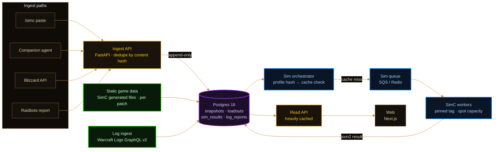

| Component | Responsibility |
|---|---|
| **Ingest API** | Validates and normalises input from any of four sources into a canonical snapshot payload. Deduplicates by content hash. Never mutates an existing snapshot. |
| **Read API** | Serves character pages, diffs, sim results, and plans. Snapshots are immutable, so cache invalidation is trivial. |
| **Sim orchestrator** | Builds SimC profile text from a snapshot plus options, hashes it, checks the cache, enqueues on a miss. |
| **SimC workers** | Stateless containers. Pull a job, write the profile, exec `simc`, parse `json2`, write the result, exit. CPU-bound and bursty, so they run on spot capacity. |
| **Log ingest** | Pulls fight and table data from Warcraft Logs v2 under a points-per-hour budget and normalises it into a comparable shape. |
| **Static data pipeline** | On each SimC release, loads item, spell, and talent reference data keyed by `game_version`. Old versions are never overwritten. |

<details>
<summary><b>Sim job kinds</b></summary>
<br>

| Kind | Iterations | What it answers |
|---|---|---|
| `baseline` | 10,000 | How much does this snapshot do. Runs automatically on every new snapshot. |
| `vault` | 5,000 | Which of these nine Great Vault items is worth the most. |
| `droptimizer` | 5,000 | What from this instance and difficulty would improve me. |
| `top_gear` | 10,000 | Best combination of what is already in my bags, under a combination ceiling. |
| `talent_compare` | 10,000 | Which of my loadouts does best on my actual gear. |
| `stat_weights` | 10,000 | Marginal value per stat point right now. Expensive; rate-limited. |

Comparison sims set `deterministic=1` so A/B deltas are not noise.

</details>


## 📜 Quest log

Each milestone ships and demos on its own. M0 is in progress on this branch; the rest are queued in [`docs/BACKLOG.md`](docs/BACKLOG.md) as agent-sized tickets.

<p align="center">
  
</p>


## 📖 The Codex

Read these in order before touching anything. Several WoW concepts are named misleadingly and will be modelled wrong by anyone reasoning from the names alone.

| Tome | What it holds |
|---|---|
| [`CLAUDE.md`](CLAUDE.md) | Operating context for agents. Hard invariants, conventions, anti-patterns, and when to stop and ask. |
| [`docs/IMPLEMENTATION_PLAN.md`](docs/IMPLEMENTATION_PLAN.md) | The spec. Landscape, gap analysis, architecture, data model, subsystems, API surface, milestones. |
| [`docs/DECISIONS.md`](docs/DECISIONS.md) | Architecture Decision Records. Read before proposing an alternative to anything in the plan. |
| [`docs/COMPETITIVE_LANDSCAPE.md`](docs/COMPETITIVE_LANDSCAPE.md) | What Raidbots, Warcraft Logs, bloodmallet, Raider.IO and the rest do well and badly, and the ranked list of what Bronze takes from each. |
| [`docs/GLOSSARY.md`](docs/GLOSSARY.md) | WoW domain terms for people who have not played. Bonus IDs, loadouts, the Great Vault, tier-set discontinuities. |
| [`docs/BACKLOG.md`](docs/BACKLOG.md) | M0 and M1 tickets with sizes, dependencies, and acceptance criteria. |
| [`docs/PRODUCT.md`](docs/PRODUCT.md) | Who this is for and what "good" means to a player. |
| [`docs/SETUP.md`](docs/SETUP.md) | Machine setup. Pinned tool versions and how to install them without a package manager. |
| [`docs/AGENT_WORKFLOW.md`](docs/AGENT_WORKFLOW.md) | How work moves through the repo: roles, ticket lifecycle, conventions, escalation, and how to reuse the harness elsewhere. |
| [`docs/DATA_SOURCES.md`](docs/DATA_SOURCES.md) | Per-API auth, rate limits, terms, and known breakage. |
| [`docs/SIMC_FORMAT.md`](docs/SIMC_FORMAT.md) | The `/simc` parser reference and fixture index. |

> [!WARNING]
> **Domain warning.** "Item level" is not a level. "Bonus IDs" are not bonuses. "Loadout" and "spec" are different things. A character's "vault" refreshes weekly and contains choices, not items. The same item ID with different bonus IDs is a materially different item. Read the glossary before designing any schema that touches these.


## 🛡️ Hard invariants

Violating any of these is a bug even if the tests pass.

- $${\color{orange}\textsf{Snapshots are immutable.}}$$ There is no `UPDATE` on the snapshots table. New state is a new row. History is the product.
- $${\color{orange}\textsf{We do not compute item stats.}}$$ Upgrade tracks, crafted quality, tertiaries, set bonuses, and scaling curves are SimulationCraft's job. Bronze stores and presents.
- $${\color{orange}\textsf{Profile generation is byte-deterministic.}}$$ Same snapshot plus same options yields byte-identical SimC text. No timestamps, no unordered iteration, no locale-dependent floats. The sim cache, and therefore the cost model, depends on it.
- $${\color{mediumorchid}\textsf{Game data is versioned, never overwritten.}}$$ Items, spells, and talents are keyed by `game_version`. A snapshot from three patches ago must still render.
- $${\color{mediumorchid}\textsf{Raw input is preserved unconditionally.}}$$ The original `/simc` string is stored even when parsing succeeds. If the parser turns out to be wrong, history is reparsed.
- $${\color{mediumorchid}\textsf{Unknown fields are preserved, not dropped.}}$$ The `/simc` format grows sub-attributes on patch day. Unrecognised keys go into the payload verbatim.

<details>
<summary><b>Things Bronze deliberately does not do</b></summary>
<br>

- **No Raidbots sim submission.** There is no sanctioned programmatic path. Importing a finished Raidbots *report* is supported.
- **No item catalog from the Blizzard item endpoint.** Tens of thousands of calls against a 36k/hour budget for data that goes stale every patch. Game data comes from SimC's generated files instead.
- **No feature that needs the Blizzard API to be up.** Talent loadouts vanished from the Profile API in patch 11.2 and stayed gone. Everything core works from `/simc` and the companion agent alone.
- **No Lua execution.** The companion agent reads SavedVariables with a constrained literal parser. No interpreter, no `load()`, no metatables.
- **No live external API calls from tests or CI.** Rate limits are shared and finite. Real responses are recorded as fixtures and replayed.
- **No new sim engine, no in-game rotation advice.**

</details>


## ⚒️ Getting started

Requires Python 3.12 and [uv](https://docs.astral.sh/uv/). Docker is needed once the local stack lands. Pinned versions and package-manager-free install steps are in [`docs/SETUP.md`](docs/SETUP.md).

```bash
make setup
```

That syncs dependencies from the lockfile, installs the pre-commit hooks, and copies `.env.example` to `.env`. Then:

| Target | What it does |
|---|---|
| `make lint` | Ruff check, Ruff format check, and `mypy --strict` over `api/src/`. This is the commit gate. |
| `make test` | The full pytest suite. Anything marked `live` is excluded and never runs in CI. |
| `make test-parser` | Parser fixtures, determinism, and round-trip suites. Required green for any change to `simc_parser.py`, `profile_builder.py`, or `talent_codec.py`. |
| `make hooks-test` | The agent hook scripts under Python 3.12 and 3.9. |
| `make ci` | Everything CI runs. |
| `make up` | The Docker Compose stack: Postgres 16, Redis, the API, one SimC worker, waited to healthy. `make down` stops it. The first run compiles SimC (see `docs/SETUP.md`). |
| `make migrate` | `alembic upgrade head`. Lands with ticket M0-04. |

Every worktree gets its own Compose project name and port block derived from its checkout path, so parallel agents can run `make up` side by side. `make env` prints the values.

<details>
<summary><b>Environment variables</b></summary>
<br>

| Variable | Source | Needed for |
|---|---|---|
| `BNET_CLIENT_ID` / `BNET_CLIENT_SECRET` | [develop.battle.net](https://develop.battle.net/access/clients) | Blizzard profile reads. Client credentials only, no per-user OAuth through M3. |
| `BNET_REGION` | `us`, `eu`, `kr`, `tw` | Which API host to talk to. |
| `WCL_CLIENT_ID` / `WCL_CLIENT_SECRET` | [warcraftlogs.com/api/clients](https://www.warcraftlogs.com/api/clients) | Log import in M5. The points budget is shared with production; never used from tests. |
| `RAIDERIO_API_KEY` | [raider.io/api](https://raider.io/api) | Optional. Public endpoints work without it; a key raises the rate limit. |
| `DATABASE_URL` / `REDIS_URL` | Docker Compose | Leave unset locally to use the per-worktree defaults. |

</details>


## 🧙 How this repository is built

Bronze is built by a team of Claude Code agents coordinated by a conductor session. Humans own decisions, credentials, and real-world fixtures. The setup is meant to be copied into other projects.

- [`AGENTS.md`](AGENTS.md) is the constitution every agent reads first; `CLAUDE.md` imports it.
- [`docs/AGENT_WORKFLOW.md`](docs/AGENT_WORKFLOW.md) covers roles, the ticket lifecycle, conventions, escalation, and how to reuse the harness elsewhere.
- [`.claude/agents/`](.claude/agents) holds the role definitions, [`.claude/skills/`](.claude/skills) the conductor loop and recurring rituals, [`.claude/rules/`](.claude/rules) path-scoped rules, and [`.claude/hooks/`](.claude/hooks) the tested guardrails.
- [`.github/`](.github) carries CI with required checks, an automated Claude review, an `@claude` responder, and a one-shot script that applies branch rules.

```
api/        FastAPI ingest + read API, SQLAlchemy models, Alembic migrations, tests and fixtures
worker/     SimulationCraft worker image (pinned SimC tag)            — M2
web/        Next.js frontend                                          — M1-08
agent/      Go companion agent + in-game addon                        — M4
pipeline/   Static game-data ingest from SimC's generated files       — M1-05
docs/       Spec, decisions, glossary, backlog, product, workflow, data sources, SimC format
```


## 🧰 Tech stack

<p align="center">
  
  
  
  
  
  
  
  
  
  
  
  
</p>

| Layer | Choice | Why |
|---|---|---|
| API | Python 3.12 + FastAPI | Async, typed, fast to write. |
| Database | Postgres 16 | JSONB for snapshot payloads. Partial unique indexes enforce the sim cache and snapshot dedupe. |
| Queue | SQS, or Redis + RQ locally | Sim jobs are coarse-grained and interruption-tolerant. |
| Sim workers | Docker image with SimC built from a pinned tag | The pinned version is part of the cache key. An upgrade invalidates the cache by construction. |
| Worker compute | Fargate Spot or spot K8s nodes | CPU-bound, bursty, interruptible. A killed worker just re-queues. |
| Frontend | Next.js + TypeScript | Server components suit a read-heavy, cache-friendly page model. |
| Companion agent | Go, single static binary | Cross-platform, no runtime, easy to sign and distribute. |
| Static data | Python, scheduled | Runs on SimC releases, not on a clock. |


## 🏛️ Why not just use…

<details>
<summary><b>…Raidbots, Wowhead, Warcraft Logs, Raider.IO, Archon, Bloodmallet, WoWAnalyzer, or the Armory?</b></summary>
<br>

| Tool | Does well | Does not do |
|---|---|---|
| Raidbots | Cloud SimC. Droptimizer, Top Gear. The de facto sim frontend. | Stateless. No history. Credit-gated. No submission API. |
| Wowhead | Item and spell database, talent calculator, guides. | The calculator has no knowledge of your character or gear. No sim. |
| Warcraft Logs | Combat log storage, parses, rankings. | No forward planning. Does not know what you *could* be doing. |
| Raider.IO | M+ score and run history. | Score only. No gear or build planning. |
| Archon / Murlok | Aggregated top-player builds. | Descriptive of the meta, not prescriptive for you. Murlok broke when the talent API vanished. |
| Bloodmallet | Pre-computed trinket and embellishment charts. | Generic profiles, not your character. |
| WoWAnalyzer | Log-based play quality analysis. | Inconsistent spec coverage. No gear or sim integration. |
| Blizzard Armory | Official current-state view. | Current state only. No history, planning, or sim. |

Every one of them is a single-purpose tool with no memory of the user. Bronze is the memory.

</details>


<p align="center">
  <sub>
    Licensed under <a href="LICENSE">Apache-2.0</a>.<br>
    World of Warcraft and Blizzard Entertainment are trademarks of Blizzard Entertainment, Inc. Bronze is an independent fan project and is not affiliated with or endorsed by Blizzard.<br>
    Game data is derived from SimulationCraft's generated files (GPL; run as a separate process, never linked). Item and spell tooltips are provided by Wowhead. Combat log data comes from Warcraft Logs using the user's own report codes.<br>
    Each source's terms are documented in [`docs/DATA_SOURCES.md`](docs/DATA_SOURCES.md). Security reports go through [`SECURITY.md`](SECURITY.md).
  </sub>
</p>

<p align="center">
  
</p>
