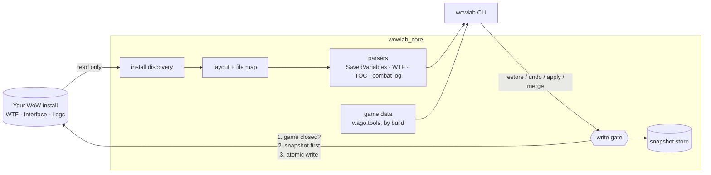

<p align="center">
  
</p>

<p align="center">
  <a href="https://github.com/sandgraal/wowlab/actions/workflows/ci.yml"></a>
  
  
  
  <a href="LICENSE"></a>
</p>

<p align="center">
  <b>Ever wondered what all those files in your WoW folder actually are?</b><br>
  wowlab reads your World of Warcraft install, tells you what every file is and whether it is safe to touch,<br>
  snapshots your whole setup, and lets you change things and change them back.<br>
  It runs on your own machine, never touches the game while it runs, and never uploads anything.
</p>

---

## Why you might want it

- **"I broke my UI and I don't know how."** Take a snapshot before you experiment. If something goes wrong, `wowlab undo` puts every file back exactly as it was.
- **"What is `config-cache.wtf` and can I delete it?"** `wowlab explain` answers that for any file in your install: what it is, who writes it, when, and whether editing it is safe.
- **"My addon settings are a mess."** Read any addon's saved settings as plain text, with nothing executed and nothing changed.
- **"I play on the Forever beta and nothing is documented."** wowlab was built against a real Forever install: its folder layout, file formats and combat log are written up in plain words.
- **"I want to see, and later plan, my character offline."** `wowlab char show` already shows what wowlab's own small in-game addon recorded for a character; a talent planner is what the next wave builds. See [the full vision](#-the-full-vision).

## ✨ What it does today

| | Feature | Command |
|---|---|---|
| 🔍 | **Explain any file.** Every path in your install mapped: what it is, who writes it, when, and whether wowlab may edit it. | `wowlab explain PATH` · `wowlab tree --explain` |
| 🩺 | **Health check.** Finds your install, its flavors and versions, whether the game is running, and your server-sync settings. | `wowlab doctor` |
| 📸 | **Snapshots.** Save your whole setup (settings, keybinds, macros, addons and their saved data) and compare any two snapshots, down to the individual addon setting. | `wowlab snap create` · `snap diff A B` |
| ↩️ | **Undo, for real.** Put a snapshot back, or undo the last change. You see the plan first, and it refuses while the game is running. | `wowlab snap restore` · `wowlab undo` |
| 📜 | **Read your saved data.** Addon SavedVariables, CVars, keybinds, macros and your addon list, as readable text or JSON. | `wowlab sv dump` · `cvar` · `binds` · `macros` · `addons` |
| 📚 | **Game data.** Any game table for your exact build, from [wago.tools](https://wago.tools), cached forever and keyed by build. | `wowlab db2 fetch TABLE` |
| ⚔️ | **Combat log.** A streaming combat-log reader and a live `tail` that follows the game as it writes, even across new log files. | `wowlab log tail --follow` |
| 🎛️ | **Profiles.** Save named UI setups (`raid`, `clean`, `gamepad`) and switch between them with one command. You see the plan first, applying one also deletes files created since it was saved, and `wowlab undo` reverses it. | `wowlab profile save` · `profile apply` |
| 🔀 | **Merge addon settings.** Copy one addon's settings between characters, or from a snapshot, without clobbering the rest. Conflicts are listed and never guessed, and it first checks that the client has been loading saved data correctly. | `wowlab sv merge` |
| 🧩 | **The lab-addon and your characters.** wowlab's own small in-game addon records a character's gear, talents, customization, collections, currencies and professions (never a name) when you log out, and reads them back offline. | `wowlab addon install lab` · `wowlab char show` |
| 🎨 | **Customization looks.** Browse every race's customization options from the game's own tables, save and compare looks, import one from a character, and open it all as a local web page. Data only: it never touches the game. | `wowlab looks races` · `save` · `compare` · `page` |

<details>
<summary><b>See it in action</b> (output from a test copy of a Forever install)</summary>

```text
$ wowlab explain WTF/Account/<ACCOUNT>/SavedVariables/DBM-Party-Vanilla.lua
WTF/Account/<ACCOUNT>/SavedVariables/DBM-Party-Vanilla.lua (in flavor folder _classic_beta_)
  what:         Account-wide addon data (`## SavedVariables:`)
  written by:   Client on logout / `/reload`
  edit:         yes, through wowlab's write gate only, with the client closed
  tier:         A: ordinary addon-user behaviour
  read by:      `luadata`

$ wowlab sv dump SavedVariables/DBM-StatusBarTimers.lua
DBT_AllPersistentOptions["Default"]["DBM"]["TimerY"] = -260
DBT_AllPersistentOptions["Default"]["DBM"]["TimerPoint"] = "TOPRIGHT"
DBT_AllPersistentOptions["Default"]["DBM"]["HugeBarsEnabled"] = true
…

$ wowlab doctor --offline
Flavor _classic_beta_: product wow_classic_beta, version 1.60.1.69913
Client: not running
Snapshot store: ~/.local/share/wowlab/store (not created yet)
```

</details>

## 🛡️ The safety promises

> [!IMPORTANT]
> These are hard rules in the code, checked by tests on every change, not intentions.

- **Reading never writes.** Looking at your install changes nothing: no temp files, caches or lock files inside it.
- **One door for every change.** Anything wowlab writes goes through a single *write gate*. The gate refuses while the game is running, takes a snapshot first, records what it did, and replaces files atomically. There is no "force" switch that skips any of that.
- **No Lua is ever run.** Addon data is read as data by a strict parser. Functions or code in a saved file are refused, never executed.
- **Nothing is lost.** The parsers keep every byte they don't understand. An unedited file comes back byte for byte.
- **Stays on your machine.** No accounts, no server, no uploads. The only network access is downloading public game tables from wago.tools, and you can skip it with `--offline`.
- **Clearly out of bounds, permanently.** No memory reading, no injection, no packet tampering, no input automation, no touching game `Data/` or executables, no bypassing integrity checks ([ADR-0023](docs/DECISIONS.md)). wowlab only changes what the game itself treats as your settings.

## ⚙️ How it works


```mermaid
flowchart LR
    I[("Your WoW install<br/>WTF · Interface · Logs")]
    subgraph core["wowlab_core"]
      D[install discovery] --> L[layout + file map]
      L --> P["parsers<br/>SavedVariables · WTF · TOC · combat log"]
      G[game data<br/>wago.tools, by build]
      S[(snapshot store)]
      W{{write gate}}
    end
    I -- "read only" --> D
    P --> CLI[wowlab CLI]
    G --> CLI
    CLI -- "restore / undo / apply / merge" --> W
    W -- "1. game closed?<br/>2. snapshot first<br/>3. atomic write" --> I
    W --> S
```

Flavor folders, product codes and build numbers are **discovered from your install**, never hard-coded, so wowlab works the same on retail and on *World of Warcraft: Forever*. The details: [`docs/LAB_PLAN.md`](docs/LAB_PLAN.md) (the spec), [`docs/LAB_FILE_MAP.md`](docs/LAB_FILE_MAP.md) (every path) and [`docs/LAB_FORMATS.md`](docs/LAB_FORMATS.md) (every file format).

## 🧭 Where it is now

wowlab grows in **waves**: the owner picks each one after reviewing the last. **Waves 1 and 2 are done**: everything in the table above. **Wave 3 is in progress**:

| | Feature | What you'll be able to do |
|---|---|---|
| 🗄️ | **db2lake** | Ask questions of the game's tables with SQL: one local database per game build, columns typed from the data, joins across builds. Read-only, and nothing leaves your machine. |
| 🌳 | **char-planner** (talents first) | View a character's class-talent build offline from what the addon recorded, plan a new one, and have it checked against the game's own tables. Legacy talents and gear come in later waves. |
| 📊 | **alt-dashboard** | One local page over every character's recorded state, with an option to hide character names. |

The plan and its tickets: [`docs/LAB_PLAN.md`](docs/LAB_PLAN.md) §14 and [`docs/BACKLOG.md`](docs/BACKLOG.md).

## 🌌 The full vision

Here is what wowlab becomes as the ideas on [the menu](docs/LAB_IDEAS.md) are built. It is a menu, not a promise: each wave is picked one at a time.

<details open>
<summary><b>🧙 Your character, offline</b></summary>

- **Plan builds without logging in.** Capture a character and plan talents and gear offline, including Forever's own talent systems (`char-planner`). Export to SimulationCraft and run sims locally (`simc-bridge`).
- **See your character in 3D.** Render it in the browser from your own game files, with gear and transmog; design outfits; pose it, light it, turn it around, and export it to 3D formats or a printable model (`character-studio`, `photo-studio`, `char-export`).
- **Every alt at a glance.** A dashboard over every character; a timeline of how each one grew; scheduled archives of your full state (`alt-dashboard`, `digital-twin`, `time-capsule`).
- **Collect smarter.** What's left to collect and the cheapest order to get it; what in your bags is dead weight across every alt, and where to send it (`collection-router`, `bag-triage`).
- **Learn your class faster.** Nightly flashcards built from your spellbook, your talents, boss abilities and what actually killed you (`drill-cards`).
- **Tell your character's story.** A printable book and roleplay profile with your gear, portrait, firsts, zones and notable fights (`codex`). Also a D&D-style sheet, and a roguelike seeded by your real gear (`tabletop-sheet`, `roguelike-me`).
- **Customize from inspiration.** Match a concept image to the customization choices and appearances you own (`look-from-image`).

</details>

<details>
<summary><b>🎛️ Your UI, keybinds and settings</b></summary>

- **Your whole setup as a file.** Describe CVars, binds, macros and addon settings in one file, then plan, apply and roll back, with drift detection (`wow-as-code`).
- **Keybinds that fit how you play.** Spells you cast most on your easiest keys, spells you click that have no bind, and binds you never use, applied with undo (`keybind-coach`).
- **Macros that don't silently break.** A linter that checks spell names and ranks, conditionals, length, unused and duplicate macros, with fixes through the write gate (`macro-doctor`).
- **Look and feel.** Reversible font and texture packs, and nameplates designed outside the game with a live preview (`skin-packs`, `nameplate-designer`).
- **A map of your install.** A local website of your install, every file annotated, with viewers for saved data, settings and your snapshot timeline (`explorer`).

</details>

<details>
<summary><b>🧰 Addons</b></summary>

- **Install and update addons safely.** From GitHub, CurseForge or Wago, pinned and undoable, including the addon's saved data (`addon-manager`).
- **Know where your addons came from.** Compare every file to its upstream release and flag repacks or local edits (`addon-provenance`).
- **Will it break on Forever?** A static scan for the TOC version, removed APIs, the build-number trap and calls that go secret in combat (`addon-audit`).
- **Is the game really loading your saved data?** A doctor check that catches the SavedVariables loader bug if it ever returns (`sv-health`).
- **For addon authors.** Scaffolding, type stubs from the game's own API docs, a headless test harness, an in-game REPL, and an agent-friendly server over your install (`addon-kit`, `api-types`, `addon-harness`, `dev-console`, `api-rag`, `lab-mcp`).

</details>

<details>
<summary><b>📚 Game data and the world</b></summary>

- **Query the game like a database.** SQL over every game table, across builds; relationship graphs of items, spells, quests, NPCs and zones (`db2lake`, `azeroth-graph`).
- **See what changed in each beta build.** Automatic changelogs of the tables you care about, and hotfixes overlaid (`build-diff`, `hotfix-reader`).
- **Fill in Forever's missing quests.** Record givers, turn-ins and objectives as you play, exported as corrections Questie can use (`quest-recorder`).
- **Auction-house memory.** Your own price history, linked to patch changes that move prices (`market-memory`).
- **Lore answers with sources.** Questions answered only from quest, NPC and gossip text in the game's tables, with citations (`lore-companion`).
- **Straight from the game files.** Read models and textures from your own install, which unlocks everything 3D (`casc-source`).

</details>

<details>
<summary><b>📡 Live, fun and forensic</b></summary>

- **Stream overlays and smart-home triggers.** A local event feed from your saved data and combat log, driving OBS, Stream Deck, Home Assistant or Discord (`event-bus`, `overlay-sinks`).
- **Your play, visualized.** Fight replays and generative art from combat logs, heatmaps of where you've been, dashboards over your sessions (`log2art`, `zone-heatmap`, `play-lake`).
- **Tidy screenshots.** Tagged by character, zone and date, and searchable (`screenshot-organizer`).
- **Why did it crash?** Crash reports linked to the addons, settings and zone at the time (`crash-forensics`).
- **Play between sessions.** Offline mini-games or planners whose results your addon picks up at next login (`companion-loop`).

</details>

<details>
<summary><b>👥 Social (waiting on a privacy decision)</b></summary>

- **Remember good groups.** Who you grouped with, their role and your notes (`crew-book`), and which dungeon groups your online guild could form right now (`comp-builder`). These store other players' names, so they wait for their own privacy decision: opt-in, local only, never exported.

</details>

## 🚀 Try it

> [!NOTE]
> wowlab is a personal project that runs from source on your own machine. There is no installer, no app store and no hosted version, by design ([ADR-0019](docs/DECISIONS.md)). If you try it, it runs against your install, on your machine, under your control.

You need [uv](https://docs.astral.sh/uv/) (it brings Python 3.12). A game install is not needed to run the tests.

```bash
git clone https://github.com/sandgraal/wowlab && cd wowlab
make setup
uv run wowlab doctor        # finds your install and checks everything
uv run wowlab --help        # every command
```

Set `WOWLAB_WOW_ROOT` if your install is not in a default location ([`.env.example`](.env.example)). Machine setup without a package manager: [`docs/SETUP.md`](docs/SETUP.md).

> [!TIP]
> Exit codes: `0` ok, `1` error, `2` usage, `3` refused by the write gate. Only these commands change your install: `snap restore`, `undo`, `profile apply`, `sv merge` and `addon install` / `addon remove`. Every one goes through the write gate and shows the plan and asks first unless you pass `--yes`; most of them also take `--dry-run`.

<details>
<summary><b>Developer commands</b></summary>

| Target | What it does |
|---|---|
| `make lint` | ruff check, ruff format check, `mypy --strict`. The commit gate. |
| `make test` | The full pytest suite. Anything marked `live` is excluded and never runs in CI. |
| `make test-parser` | Parser fixtures and round-trip suites. Required green for any parser change. |
| `make hooks-test` | The agent hook scripts under Python 3.12 and 3.9. |
| `make ci` | Everything CI runs. |

</details>

## 🏗️ How it's built

wowlab is written by Claude Code agents coordinated by a *conductor* session, while the owner makes every decision and captures the real test files from the game. Each change is a small ticket with checkable acceptance criteria. Every branch gets an independent code review, plus security and WoW-accuracy reviews wherever they apply. The files that rewrite your data (the SavedVariables parser, the write gate, sv-merge and profiles) get their tests written first by a different agent than the one that writes the code. Test files are real captures from the game, scrubbed of names and identifiers before they are committed. Details: [`docs/AGENT_WORKFLOW.md`](docs/AGENT_WORKFLOW.md) and [`AGENTS.md`](AGENTS.md).

```
lab/core/   wowlab-core: the library and the wowlab CLI (later apps: lab/<app>/)
scripts/    repository tooling, including the fixture capture and scrub tool
tests/      tests for the agent harness hooks
docs/       spec, formats, file map, ideas, decisions, backlog, glossary, workflow
.claude/    agent definitions, skills, path rules, guard hooks
```

## 📖 Documents

| Document | What it holds |
|---|---|
| [The wiki](https://github.com/sandgraal/wowlab/wiki) | Guides for every command, the safety rules in plain words, a command reference, notes on the Forever beta, a glossary and the roadmap. |
| [`docs/LAB_PLAN.md`](docs/LAB_PLAN.md) | The spec: purpose, architecture, every module, testing, how waves work, the Wave 2 and Wave 3 plans. |
| [`docs/LAB_FILE_MAP.md`](docs/LAB_FILE_MAP.md) | Every path in an install: what it is, who writes it, whether it is safe to edit. |
| [`docs/LAB_FORMATS.md`](docs/LAB_FORMATS.md) | The client file formats, with what real Forever captures showed. |
| [`docs/LAB_IDEAS.md`](docs/LAB_IDEAS.md) | The menu for later waves. |
| [`docs/GLOSSARY.md`](docs/GLOSSARY.md) | WoW and client terms, several of them misleading. |
| [`docs/DATA_SOURCES.md`](docs/DATA_SOURCES.md) | The install, wago.tools, and a log of every surprise. |
| [`docs/DECISIONS.md`](docs/DECISIONS.md) | Architecture decisions (ADRs). |
| [`docs/BACKLOG.md`](docs/BACKLOG.md) | The current wave's tickets. |
| [`docs/handoffs/`](docs/handoffs/) | Capture runbooks and wave reviews. |
| [`AGENTS.md`](AGENTS.md) | The constitution: the hard rules above, in full. |
| [`docs/AGENT_WORKFLOW.md`](docs/AGENT_WORKFLOW.md) · [`docs/SETUP.md`](docs/SETUP.md) | How work moves; machine setup. |

## License and affiliation

[Apache-2.0](LICENSE). World of Warcraft and Blizzard Entertainment are trademarks of Blizzard Entertainment, Inc. wowlab is an independent personal project, not affiliated with or endorsed by Blizzard. No game assets or Blizzard code are committed here. Security and privacy reports: [`SECURITY.md`](SECURITY.md). This repository previously held a different project, retired on 2026-09-21 (ADR-0025, git tag `bronze-final`).
